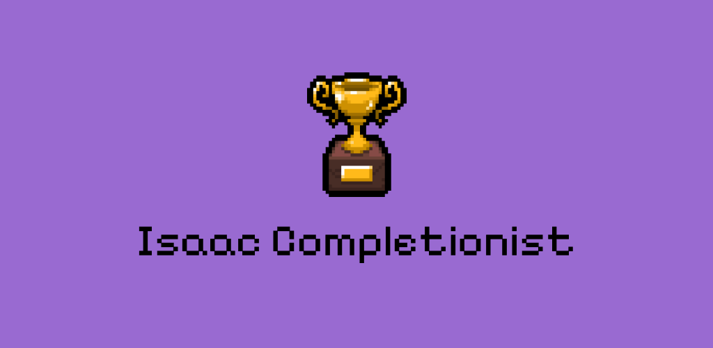
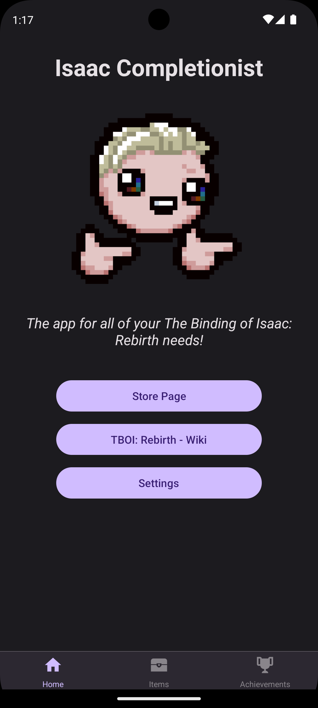
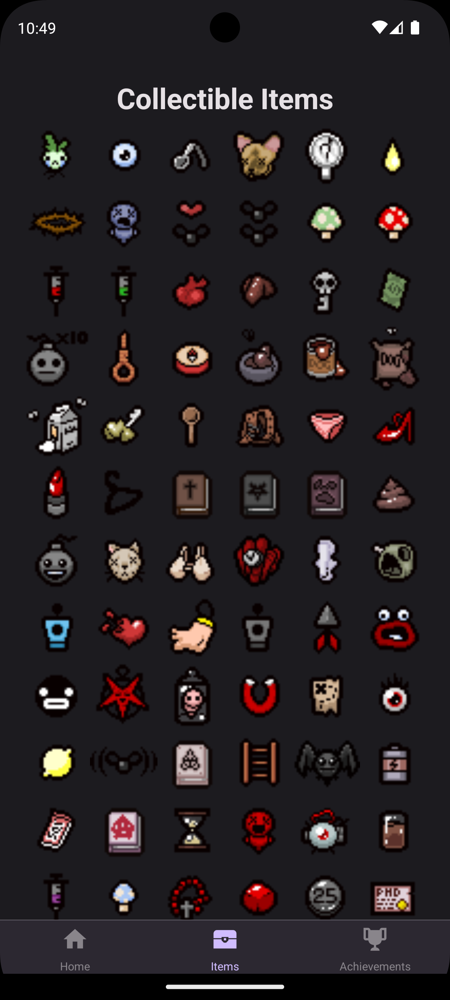
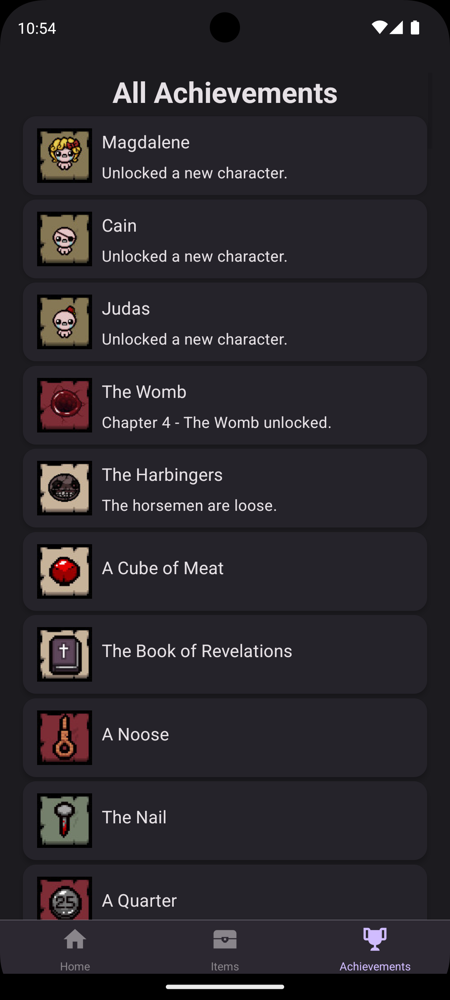
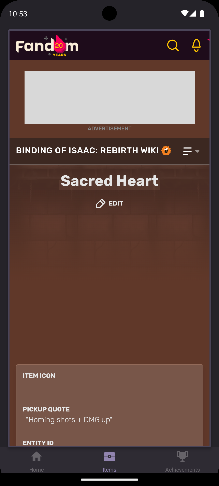
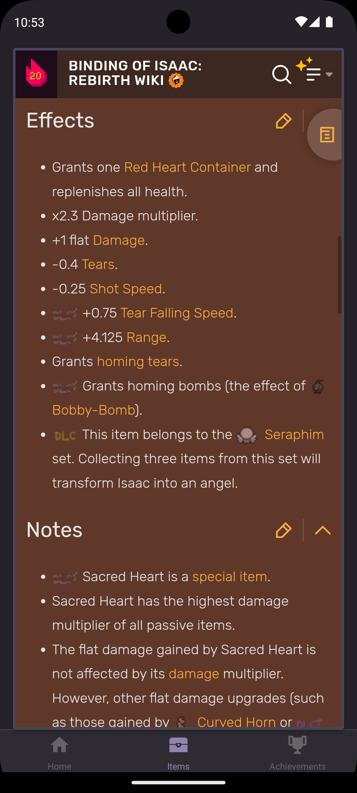
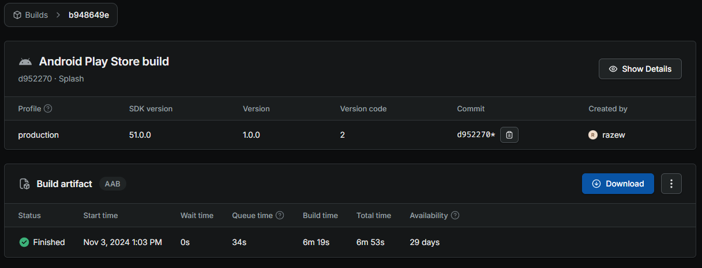

# Inlämningskrav för VG

## Inlämning

Lägg in den här filen i rooten av ditt projektet. Se sedan till att lägg till bilder andra filer som behövs i projektet också och uppdatera länkarna nedan i det här dokumentet.

När du är klar zippar du ihop projektet (utan node_modules) och lämnar in inlämningen på nytt i Google Classroom.

**OBS: Öppna den här filen som preview så du ser att dina länkar är rätt. Om bilder inte visas så kommer VG kompletteringen inte att godkännas.**

## Förbered appen

Utöver det som ska anges i den här filen så ska du även lägga till en appikon och en splashscreen i [app.json](./app.json) filen samt eventuella andra inställningar om du har använt dig av exempelvis kameran eller GPS'en, den informationen finns dokumenterad för respektive modul i Expo referensen.

**Det här måste göras innan du bygger appen.**

## Skyltfönstret i butiken & Bygga appen.

Nu kan du bygga appen med EAS och ladda hem filen när den är klar. Fyll sedan i nedanstående uppgifter som bevis på att du bara är några få steg ifrån att lansera din applikation på butiken.

**Applikationens Namn:**  
Isaac Completionist

**Kort Beskrivning (max 80):**  
Hjälpmedel för att se items och achievements i The Binding of Isaac: Rebirth

**Fullständig Beskrivning (max 4000):**  
Isaac Completionist är en app för fans av spelet The Binding of Isaac: Rebirth. Med denna app kan spelare lätt navigera genom alla items och achievements i spelet för att lättare kunna kolla upp vad olika items gör, och deras synergier med andra items, samt vad de behöver för att kryssa av alla achievements.

Appen ger en översikt av alla collectible items i en praktisk grid-vy, där varje item kan klickas för att snabbt öppna en wiki-sida om just det itemet direkt i appen. Dessutom finns en separat sektion för achievements, vilket gör det enkelt att följa sina framsteg och spåra vilka som återstår.

Framtida uppdateringar kan även inkludera möjligheten att automatiskt sortera achievements baserat på vad spelaren redan har låst upp, vilket gör det ännu enklare att sätta upp mål och planera sin väg till 100% completion!

# Bilder
Applikationens ikon och laddningsbild.

_Notera att bakgrundsfärgen för splashscreenen sätts i app.json_  
[Läs mer om dessa bilder här](https://docs.expo.dev/develop/user-interface/splash-screen-and-app-icon/).

En omslagsbild som visas på olika ställen i butiken.

Två till åtta fönsterbilder i formatet 16:9 eller 9:16 samt bredd och höjd mellan 320 och 3840 px.

[Binärfilen](./application-b948649e-6a53-4a08-818a-f74669631d51.aab)

Tänk på att bilden måste visa både "Created By" och "Start Time".
